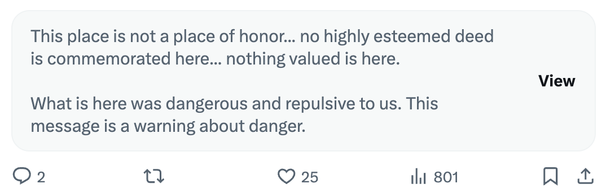

# Long-term nuclear waste warning messages for Twitter

Replace Twitter.com warning about content from blocked accounts with a [more meaningful message](https://en.wikipedia.org/wiki/Long-term_nuclear_waste_warning_messages).

## Running this extension

1. Clone this repository.
2. Load this directory in Chrome as an [unpacked extension](https://developer.chrome.com/docs/extensions/mv3/getstarted/development-basics/#load-unpacked).
3. Use Twitter.com as normal.
4. Profit:

